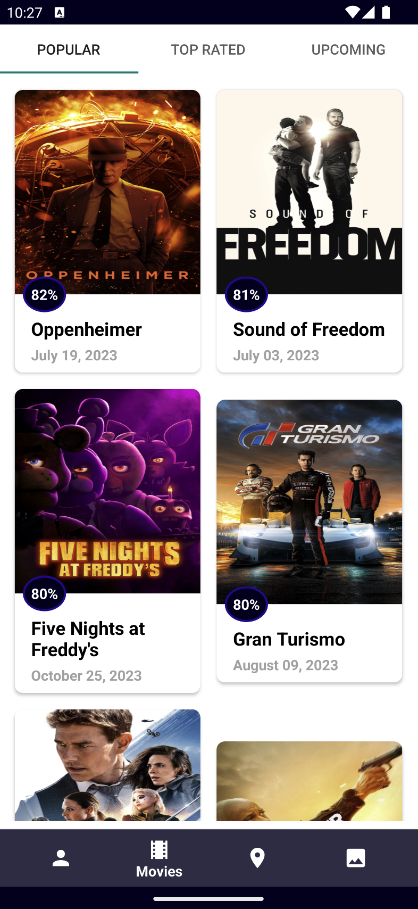
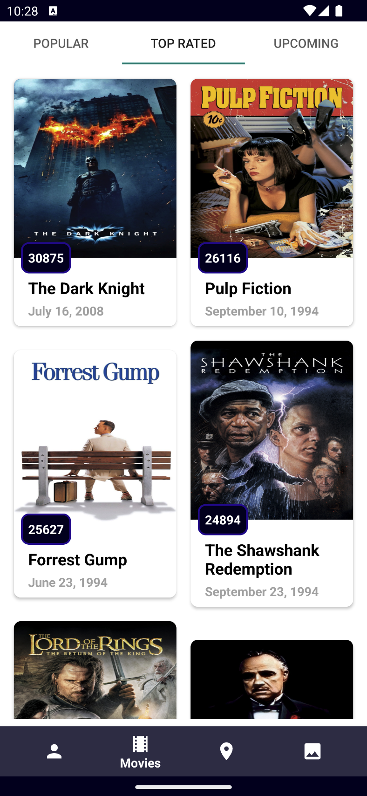
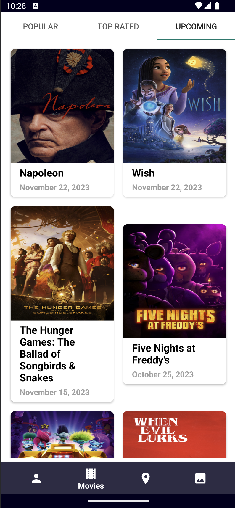
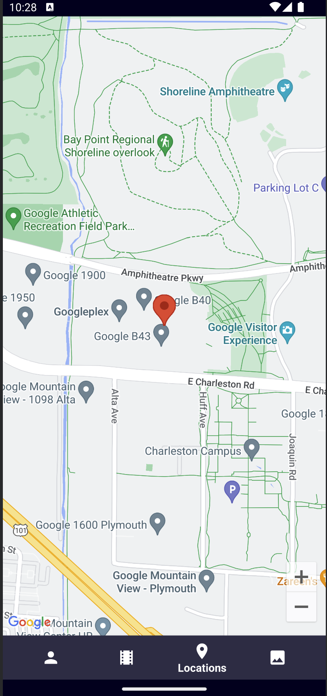
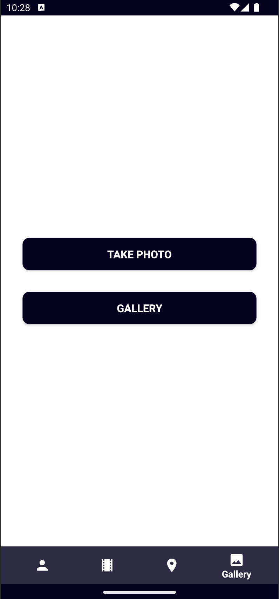

# Android Movies Application

This is an Android Application to see a list of movies by popularity by rated, see a list of actors sorted by popularity, track location and show on map also take photo or take from gallery and upload to firestore.

 

 

 


## Installation
Clone this repository and import into **Android Studio**
```bash
git clone https://github.com/ajidres/movies.git
```

## Configuration
### Keystores:
Create a file `app/secrets.properties` with the following info:
```gradle
MAPS_API_KEY='...'
ENDPOINT_URL='...'
ACCESS_TOKEN='...'
```

### Firebase:
Create a project in firebase, create and place the `google-services.json` under `app/` directory:


## Generating debug APK
From Android Studio:
1. ***Build*** menu
2. Build Bundle(s)/APK(s)

## Generating signed APK
From Android Studio:
1. ***Build*** menu
2. ***Generate Signed Bundle/APK...***
3. Fill in the keystore information *(you only need to do this once manually and then let Android Studio remember it)*

## Maintainers
This project is mantained by:
* [Andres Jimenez](https://github.com/ajidre)
